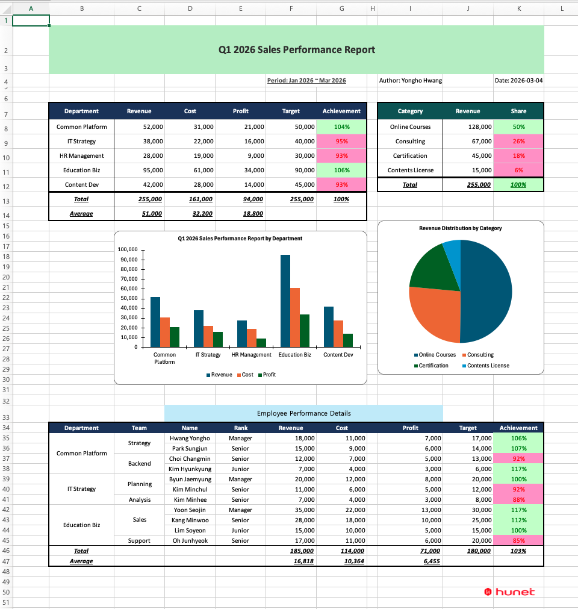

> **[한국어](./README.ko.md)** | English

# TBEG - Template Based Excel Generator

[](https://github.com/jogakdal/data-processors-with-excel/actions/workflows/ci.yml)
[](https://opensource.org/licenses/Apache-2.0)

A JVM library that generates reports by binding data to Excel templates. Works seamlessly with both Kotlin and Java.

## Key Features

- **Template-based generation**: Generate reports by binding data to Excel templates
- **Repeat data processing**: Expand list data into rows/columns with `${repeat(...)}` syntax
- **Variable substitution**: Bind values to cells, charts, shapes, headers/footers, formula arguments, etc. with `${variableName}` syntax. Values starting with `=` are treated as Excel formulas
- **Image insertion**: Insert dynamic images into template cells
- **Automatic cell merge**: Automatically merge consecutive cells with the same value in repeat data
- **Bundle**: Group multiple elements into a single unit that moves together
- **Selective field visibility**: Restrict visibility of specific fields based on conditions. Choose between DELETE (physical removal) or DIM (deactivation style) modes
- **Formula auto-adjustment**: Automatically update formula ranges (SUM, AVERAGE, etc.) when data expands
- **Conditional formatting duplication**: Automatically apply the original conditional formatting to repeated rows
- **Chart/pivot table auto-reflection**: Automatically adjust chart data ranges and pivot table source ranges when data expands (no manual refresh required when opening the file)
- **File encryption**: Set open password for generated Excel files
- **Document metadata**: Set document properties such as title, author, keywords, etc.
- **Large-scale processing**: Reliably process over 1 million rows with low CPU utilization
- **Asynchronous processing**: Process large data in the background
- **Lazy loading**: Memory-efficient data processing via DataProvider

## Why TBEG

Building Excel reports directly with Apache POI requires dozens of lines of code.

```kotlin
// Using Apache POI directly
val workbook = XSSFWorkbook()
val sheet = workbook.createSheet("Employee Status")
val headerRow = sheet.createRow(0)
headerRow.createCell(0).setCellValue("Name")
headerRow.createCell(1).setCellValue("Position")
headerRow.createCell(2).setCellValue("Salary")

employees.forEachIndexed { index, emp ->
    val row = sheet.createRow(index + 1)
    row.createCell(0).setCellValue(emp.name)
    row.createCell(1).setCellValue(emp.position)
    row.createCell(2).setCellValue(emp.salary.toDouble())
}

// Column widths, styles, formulas, charts... it never ends
```

With TBEG, you can **use the Excel template designed by your designer as-is** and simply bind data to it.

```kotlin
// Using TBEG
val data = mapOf(
    "title" to "Employee Status",
    "employees" to employeeList
)

ExcelGenerator().use { generator ->
    val bytes = generator.generate(template, data)
    File("output.xlsx").writeBytes(bytes)
}
```

Formatting, charts, formulas, and conditional formatting are **all managed in the template**. Your code focuses solely on data binding.

> [!TIP]
> **Design philosophy**: We don't reinvent what Excel already does well.
> Aggregation with `=SUM()`, conditional highlighting with conditional formatting, visualization with charts -- use the familiar Excel features as they are.
> TBEG adds dynamic data binding on top of this, and adjusts these features to work as intended even when data expands.

## At a Glance

**Template**


**Code**

```kotlin
val data = simpleDataProvider {
    value("reportTitle", "Q1 2026 Sales Performance Report")
    value("period", "Jan 2026 ~ Mar 2026")
    value("author", "Yongho Hwang")
    value("reportDate", LocalDate.now().toString())
    value("subtitle_emp", "Employee Performance Details")
    image("logo", logoBytes)
    imageUrl("ci", "https://example.com/ci.png")  // URL is also supported
    items("depts") { deptList.iterator() }
    items("products") { productList.iterator() }
    items("employees") { employeeList.iterator() }
}

ExcelGenerator().use { generator ->
    generator.generateToFile(template, data, outputDir, "quarterly_report")
}
```

**Result**



Variable substitution, image insertion, repeat data expansion, automatic cell merge, bundle, selective field visibility, formula range adjustment, conditional formatting duplication, and chart data reflection -- TBEG handles all of this automatically.

> For the full code and template download, see the [Comprehensive Example](modules/tbeg/manual/en/examples/advanced-examples-kotlin.md#11-comprehensive-example) ([Java](modules/tbeg/manual/en/examples/advanced-examples-java.md#11-comprehensive-example)).

## When to Use TBEG

| Scenario | Suitability |
|----------|-------------|
| Excel download/export functionality | Suitable |
| Generating standardized reports/statements | Suitable |
| Filling data into Excel forms provided by a designer | Suitable |
| Reports requiring complex formatting (conditional formatting, charts, pivot tables) | Suitable |
| Processing large datasets with tens to hundreds of thousands of rows | Suitable |
| Excel with dynamically changing column structures | Suitable (RIGHT repeat, selective field visibility) |
| Reading/parsing Excel files | Not suitable (TBEG is generation-only) |

> [!TIP]
> TBEG is especially useful when implementing **Excel download/export** functionality.
> It supports various output methods -- ByteArray return, Stream output, file save -- making it ready for web responses or file storage.
> By streaming data through a DataProvider, even large datasets can be processed without memory overhead.

## Add Dependency

```kotlin
// build.gradle.kts
dependencies {
    implementation("io.github.jogakdal:tbeg:1.2.3")
}
```

```groovy
// Gradle (Groovy DSL)
dependencies {
    implementation 'io.github.jogakdal:tbeg:1.2.3'
}
```

```xml
<!-- Maven -->
<dependency>
    <groupId>io.github.jogakdal</groupId>
    <artifactId>tbeg</artifactId>
    <version>1.2.3</version>
</dependency>
```

## Quick Start

### Kotlin

```kotlin
import io.github.jogakdal.tbeg.ExcelGenerator
import java.io.File

data class Employee(val name: String, val position: String, val salary: Int)

fun main() {
    val data = mapOf(
        "title" to "Employee Status",
        "employees" to listOf(
            Employee("Yongho Hwang", "Director", 8000),
            Employee("Yongho Han", "Manager", 6500)
        )
    )

    ExcelGenerator().use { generator ->
        val template = File("template.xlsx").inputStream()
        val bytes = generator.generate(template, data)
        File("output.xlsx").writeBytes(bytes)
    }
}
```

### Java

```java
import io.github.jogakdal.tbeg.ExcelGenerator;
import java.io.*;
import java.nio.file.*;
import java.util.*;

public class Example {
    public static void main(String[] args) throws Exception {
        var data = Map.<String, Object>of(
            "title", "Employee Status",
            "employees", List.of(
                Map.of("name", "Yongho Hwang", "position", "Director", "salary", 8000),
                Map.of("name", "Yongho Hong", "position", "Manager", "salary", 6500)
            )
        );

        try (var generator = new ExcelGenerator()) {
            byte[] bytes = generator.generate(new FileInputStream("template.xlsx"), data);
            Files.write(Path.of("output.xlsx"), bytes);
        }
    }
}
```

### DataProvider (Kotlin DSL / Java Builder)

<details>
<summary>Kotlin DSL</summary>

```kotlin
val provider = simpleDataProvider {
    value("title", "Employee Status")
    items("employees", listOf(
        mapOf("name" to "Yongho Hwang", "position" to "Director", "salary" to 8000),
        mapOf("name" to "Yongho Hong", "position" to "Manager", "salary" to 6500)
    ))
}
```

</details>

<details>
<summary>Java Builder</summary>

```java
SimpleDataProvider provider = SimpleDataProvider.builder()
    .value("title", "Employee Status")
    .items("employees", List.of(
        Map.of("name", "Yongho Hwang", "position", "Director", "salary", 8000),
        Map.of("name", "Yongho Hong", "position", "Manager", "salary", 6500)
    ))
    .build();
```

</details>

## Template Syntax

| Syntax | Description | Example |
|--------|-------------|---------|
| `${variableName}` | Variable substitution | `${title}` |
| `${object.field}` | Repeat item field | `${emp.name}` |
| `${repeat(collection, range, variable)}` | Repeat processing | `${repeat(items, A2:C2, item)}` |
| `${image(name)}` | Image insertion | `${image(logo)}` |
| `${size(collection)}` | Collection size | `${size(items)}` |
| `${merge(object.field)}` | Automatic cell merge | `${merge(emp.dept)}` |
| `${bundle(range)}` | Bundle | `${bundle(A5:H12)}` |
| `${hideable(value=object.field, ...)}` | Selective field visibility | `${hideable(value=emp.salary, bundle=C1:C3, mode=dim)}` |

For detailed syntax, see the [Template Syntax Reference](modules/tbeg/manual/en/reference/template-syntax.md).

## Spring Boot

In a Spring Boot environment, `ExcelGenerator` is automatically registered as a Bean.

<details open>
<summary>Kotlin</summary>

```kotlin
@Service
class ReportService(
    private val excelGenerator: ExcelGenerator,
    private val resourceLoader: ResourceLoader
) {
    fun generateReport(): ByteArray {
        val template = resourceLoader.getResource("classpath:templates/report.xlsx")
        val data = mapOf("title" to "Report", "items" to listOf(...))
        return excelGenerator.generate(template.inputStream, data)
    }
}
```

</details>

<details>
<summary>Java</summary>

```java
@Service
public class ReportService {
    private final ExcelGenerator excelGenerator;
    private final ResourceLoader resourceLoader;

    public ReportService(ExcelGenerator excelGenerator, ResourceLoader resourceLoader) {
        this.excelGenerator = excelGenerator;
        this.resourceLoader = resourceLoader;
    }

    public byte[] generateReport() throws IOException {
        Resource template = resourceLoader.getResource("classpath:templates/report.xlsx");
        Map<String, Object> data = Map.of("title", "Report", "items", List.of(...));
        return excelGenerator.generate(template.getInputStream(), data);
    }
}
```

</details>

### Configuration (application.yml)

```yaml
tbeg:
  streaming-mode: enabled       # enabled, disabled
  file-naming-mode: timestamp
  preserve-template-layout: true
```

## Large-scale Data Processing

TBEG reliably processes large data with maximum performance and minimal resources. It generates 1 million rows in approximately 9 seconds while using less than 9% of the system CPU, so it can run alongside other services on a server without concern. Both rendering and post-processing operate in streaming mode, using only a constant memory buffer regardless of data size.

### Performance Benchmark

**Test environment**: macOS (aarch64), OpenJDK 21.0.1, 12 cores, 3-column repeat + SUM formula (JMH, fork=1, warmup=1, iterations=3)

| Data Size      | Time      | CPU/Total | CPU/Core | Heap Alloc  |
|---------------:|----------:|----------:|---------:|------------:|
| 1,000 rows     | 20ms      | 282%      | 23.5%    | 11.8MB      |
| 10,000 rows    | 109ms     | 177%      | 14.7%    | 58.5MB      |
| 30,000 rows    | 315ms     | 151%      | 12.5%    | 166.0MB     |
| 50,000 rows    | 505ms     | 137%      | 11.4%    | 270.1MB     |
| 100,000 rows   | 993ms     | 130%      | 10.8%    | 540.8MB     |
| 500,000 rows   | 4,718ms   | 106%      | 8.9%     | 2,614.5MB   |
| 1,000,000 rows | 8,952ms   | 105%      | 8.8%     | 5,230.7MB   |

> Based on DataProvider + generateToFile. CPU/Total is the process total CPU time relative to wall-clock time; CPU/Core is the utilization relative to the system's total CPU capacity (divided by the number of cores).

> For detailed analysis including data provision method (Map vs DataProvider) and output method (generate/toStream/toFile) comparisons, see [Performance Benchmark Details](modules/tbeg/manual/en/appendix/benchmark-results.md).

### Comparison with Other Libraries (30,000 rows)

| Library    | Time      | Notes                                                       |
|:----------:|----------:|:-----------------------------------------------------------:|
| **TBEG**   | **0.3s**  |                                                             |
| JXLS       | 5.2s      | [Benchmark source](https://github.com/jxlsteam/jxls/discussions/203) |

> TBEG calls the POI API directly and writes in a single pass with streaming, whereas JXLS goes through an abstraction layer performing multiple passes of template parsing, transformation, and writing -- which is believed to account for this difference.

## Documentation

**For detailed documentation, see the [TBEG Manual](modules/tbeg/manual/en/index.md).**

- [TBEG Module README](modules/tbeg/README.md)
- [User Guide](modules/tbeg/manual/en/user-guide.md)
- [Template Syntax Reference](modules/tbeg/manual/en/reference/template-syntax.md)
- [API Reference](modules/tbeg/manual/en/reference/api-reference.md)
- [Configuration Options Reference](modules/tbeg/manual/en/reference/configuration.md)
- [Basic Examples](modules/tbeg/manual/en/examples/basic-examples.md)
- [Advanced Examples](modules/tbeg/manual/en/examples/advanced-examples.md)
- [Spring Boot Examples](modules/tbeg/manual/en/examples/spring-boot-examples.md)
- [Best Practices](modules/tbeg/manual/en/best-practices.md)
- [Troubleshooting](modules/tbeg/manual/en/troubleshooting.md)
- [Library Comparison](modules/tbeg/manual/en/appendix/library-comparison.md)
- [Developer Guide](modules/tbeg/manual/en/developer-guide.md)

## Run Samples

Samples use the `modules/tbeg/src/test/resources/templates/template.xlsx` template.

```bash
# Kotlin sample
./gradlew :tbeg:runSample
# Output: build/samples/

# Java sample
./gradlew :tbeg:runJavaSample
# Output: build/samples-java/

# Spring Boot sample
./gradlew :tbeg:runSpringBootSample
# Output: build/samples-spring/
```

## Requirements

- Java 21+
- Kotlin 2.1.20+ (when used in Kotlin projects)

## Author

[Yongho Hwang](https://github.com/jogakdal) (jogakdal@gmail.com)

## License

[Apache License 2.0](LICENSE)
