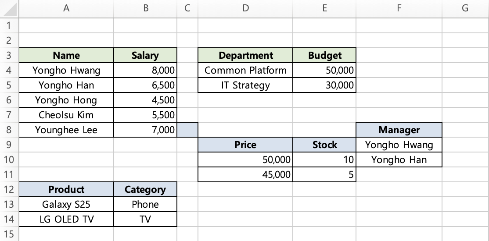
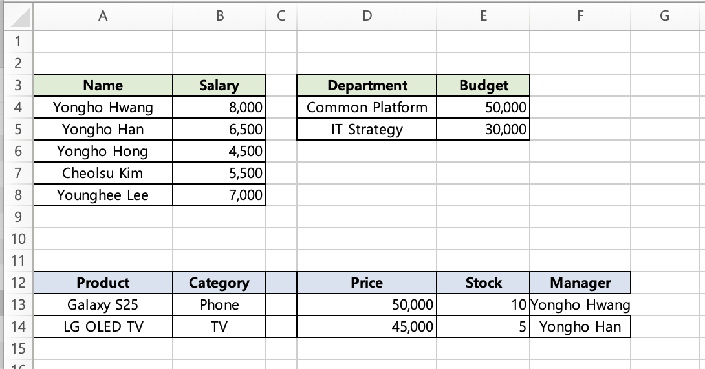

> **[한국어](../../ko/examples/advanced-examples-java.md)** | English

# TBEG Advanced Examples (Java)

## Table of Contents
1. [DataProvider Usage](#1-dataprovider-usage)
   - [1.1 SimpleDataProvider.Builder](#11-simpledataproviderbuilder)
   - [1.2 Direct ExcelDataProvider Implementation](#12-direct-exceldataprovider-implementation)
   - [1.3 JPA/Spring Data Integration](#13-jpaspring-data-integration)
   - [1.4 MyBatis Integration](#14-mybatis-integration)
   - [1.5 External API Integration](#15-external-api-integration)
2. [Asynchronous Processing](#2-asynchronous-processing)
3. [Variables in Formulas](#3-variables-in-formulas)
4. [Hyperlinks](#4-hyperlinks)
5. [Multiple Sheets](#5-multiple-sheets)
6. [Large-Scale Data Processing](#6-large-scale-data-processing)
7. [Multiple Repeat Regions](#7-multiple-repeat-regions)
8. [Rightward Repeat](#8-rightward-repeat)
9. [Empty Collection Handling](#9-empty-collection-handling)
10. [Internationalization (I18N)](#10-internationalization-i18n)
11. [Comprehensive Example](#11-comprehensive-example)
12. [Automatic Cell Merge in Practice](#12-automatic-cell-merge-in-practice)
13. [Bundle](#13-bundle)
14. [Selective Field Visibility](#14-selective-field-visibility)

> [!NOTE]
> The examples in this document load templates from the `resources/templates/` directory.
> To read directly from the file system, use `new FileInputStream("template.xlsx")`.

---

## 1. DataProvider Usage

DataProvider is a core concept in TBEG. It supports **lazy loading** and **streaming** for efficient processing of large datasets.

### Comparison of Data Supply Methods

| Method | Memory Usage | Best For |
|--------|-------------|----------|
| `Map<String, Any>` | Loads all at once | Small datasets, simple reports |
| `SimpleDataProvider.Builder` | Lazy loading | Medium-scale, general use |
| `ExcelDataProvider` implementation | Full control | Large-scale, direct DB integration |

---

### 1.1 SimpleDataProvider.Builder

The most convenient approach using the Builder pattern.

#### Template (template.xlsx)

|   | A                                | B               | C             |
|---|----------------------------------|-----------------|---------------|
| 1 | ${title}                         |                 |               |
| 2 | Date: ${date}                    | Author: ${author}  |               |
| 3 | ${repeat(employees, A5:C5, emp)} |                 |               |
| 4 | Name                             | Position        | Salary        |
| 5 | ${emp.name}                      | ${emp.position} | ${emp.salary} |

- **Single values**: `${title}`, `${date}`, `${author}` -- supplied via DataProvider's `value()`
- **Repeat region**: `${repeat(employees, A5:C5, emp)}` -- supplied via DataProvider's `items()`
- **Item properties**: `${emp.name}`, `${emp.position}`, `${emp.salary}` -- field references for each item

#### Basic Usage

```java
import io.github.jogakdal.tbeg.SimpleDataProvider;
import java.time.LocalDate;
import java.util.List;

// Define data class
record Employee(String name, String position, int salary) {}

SimpleDataProvider provider = SimpleDataProvider.builder()
    // Single values
    .value("title", "Employee Status Report")
    .value("date", LocalDate.now())
    .value("author", "Yongho Hwang")
    // Collection (List)
    .items("employees", List.of(
        new Employee("Yongho Hwang", "Director", 8000),
        new Employee("Yongho Han", "Manager", 6500)
    ))
    .build();
```

#### Lazy Loading (Lambda)

Defers data loading until it is actually needed.

```java
import io.github.jogakdal.tbeg.ExcelGenerator;
import io.github.jogakdal.tbeg.SimpleDataProvider;
import java.io.InputStream;
import java.nio.file.Files;
import java.nio.file.Path;
import java.time.LocalDate;
import java.util.Iterator;
import java.util.List;

record Employee(String name, String position, int salary) {}

public class LazyLoadingExample {

    // Method that queries employee count (SELECT COUNT(*) query)
    static int countEmployees() {
        // With JPA:
        // return (int) employeeRepository.count();
        // return employeeRepository.countByDepartmentId(deptId);

        // Dummy data for example
        return 3;
    }

    // Method that streams employee list
    static Iterator<Employee> streamEmployees() {
        // With JPA:
        // return employeeRepository.findAll().iterator();
        // return employeeRepository.streamAll().iterator();  // for large datasets

        // Dummy data for example
        return List.of(
            new Employee("Yongho Hwang", "Director", 8000),
            new Employee("Yongho Han", "Manager", 6500),
            new Employee("Yongho Hong", "Assistant Manager", 4500)
        ).iterator();
    }

    public static void main(String[] args) throws Exception {
        // 1. Query the count first (lightweight query)
        int employeeCount = countEmployees();

        // 2. Create DataProvider (collection data is NOT loaded at this point)
        SimpleDataProvider provider = SimpleDataProvider.builder()
            // Single values
            .value("title", "Employee Status Report")
            .value("date", LocalDate.now())
            .value("author", "Yongho Hwang")
            // Collection: provide count along with lazy loading
            .items("employees", employeeCount, () -> streamEmployees())
            .build();

        // 3. Generate Excel (the lambda is invoked here, loading the data)
        try (ExcelGenerator generator = new ExcelGenerator()) {
            InputStream template = LazyLoadingExample.class.getResourceAsStream("/templates/template.xlsx");
            if (template == null) {
                throw new IllegalStateException("Template not found.");
            }

            byte[] result = generator.generate(template, provider);
            Files.write(Path.of("output.xlsx"), result);
        }
    }
}
```

**Execution flow:**
1. `countEmployees()` is called -- only the count is queried first (lightweight query)
2. `SimpleDataProvider.builder()...build()` is called -- Provider object is created (collection data is NOT loaded)
3. `generator.generate(template, provider)` is called
4. When the `employees` data is needed during template processing, the lambda executes and queries the DB
5. The generated Excel byte array is saved to a file

**Why providing a count is recommended:**
- TBEG can determine the total row count upfront and calculate formula ranges immediately
- No need to iterate over the data twice
- A `SELECT COUNT(*)` query in the DB is very fast as it typically uses only indexes

> [!NOTE]
> Everything works correctly even without providing a count. However, TBEG will need to traverse the collection first to determine the total row count, which may cause a performance penalty due to double iteration.

#### Including Images

```java
SimpleDataProvider provider = SimpleDataProvider.builder()
    .value("company", "Hunet Inc.")
    // Provide as ByteArray directly
    .image("logo", LazyLoadingExample.class.getResourceAsStream("/images/logo.png").readAllBytes())
    // Provide as URL (automatically downloaded at generation time)
    .imageUrl("signature", "https://example.com/signatures/user123.png")
    // Lazy loading (queries the DB when the image is actually needed)
    .imageFromSupplier("stamp", () -> stampRepository.findByUserId(currentUserId).getImageData())
    .build();
```

> Using `imageFromSupplier()` defers expensive operations like DB queries or external API calls until the image is actually needed.

#### Document Metadata

```java
SimpleDataProvider provider = SimpleDataProvider.builder()
    .value("title", "Report")
    .metadata(meta -> meta
        .title("2026 Monthly Report")
        .author("Yongho Hwang")
        .subject("Monthly Performance")
        .keywords("monthly", "report", "performance")
        .company("Hunet Inc."))
    .build();
```

---

### 1.2 Direct ExcelDataProvider Implementation

While `SimpleDataProvider.Builder` is sufficient for most cases, directly implementing the interface is advantageous in the following situations.

#### Comparison with SimpleDataProvider

| Aspect | SimpleDataProvider | Direct Implementation |
|--------|-------------------|----------------------|
| Data dependencies | Not possible | Possible (inter-method calls) |
| Caching query results | Workaround via external lambda variables | Natural via class fields |
| Conditional data supply | Limited to within lambdas | Free branching logic |
| Resource cleanup (DB cursors, etc.) | Not possible | Implement `Closeable` |
| Unit testing | Requires full replacement | Easy mock injection of repositories |

#### Interface Structure

```java
public interface ExcelDataProvider {
    Object getValue(String name);             // Single value
    Iterator<Object> getItems(String name);   // Collection (Iterator)
    byte[] getImage(String name);             // Image (optional)
    DocumentMetadata getMetadata();           // Metadata (optional)
    Integer getItemCount(String name);        // Item count (optional, performance optimization)
}
```

#### Implementation Example

```java
public class EmployeeReportDataProvider implements ExcelDataProvider, Closeable {

    private final Long departmentId;
    private final LocalDate reportDate;
    private final EmployeeRepository repository;

    // Cache query results in class fields to avoid redundant DB calls
    private Integer cachedCount = null;
    private String cachedDepartmentName = null;

    // Manage DB Stream resources in a field for cleanup in close()
    private Stream<Employee> employeeStream = null;

    public EmployeeReportDataProvider(Long departmentId, LocalDate reportDate, EmployeeRepository repository) {
        this.departmentId = departmentId;
        this.reportDate = reportDate;
        this.repository = repository;
    }

    @Override
    public Object getValue(String name) {
        return switch (name) {
            case "title" -> "Employee Status by Department";
            case "departmentName" -> getOrLoadDepartmentName();
            case "reportDate" -> reportDate.toString();
            case "generatedAt" -> LocalDateTime.now()
                .format(DateTimeFormatter.ofPattern("yyyy-MM-dd HH:mm"));
            // Combine results from other queries to produce a value
            case "summary" -> "Total of " + getOrLoadCount() + " members in " + getOrLoadDepartmentName();
            default -> null;
        };
    }

    @Override
    public Iterator<Object> getItems(String name) {
        return switch (name) {
            case "employees" -> {
                employeeStream = repository.streamByDepartmentId(departmentId);
                yield employeeStream.map(e -> (Object) e).iterator();
            }
            // Conditionally supply data based on department size
            case "managers" -> getOrLoadCount() > 50
                ? repository.findManagersByDepartmentId(departmentId)
                    .stream().map(e -> (Object) e).iterator()
                : null;
            default -> null;
        };
    }

    @Override
    public Integer getItemCount(String name) {
        return switch (name) {
            case "employees" -> getOrLoadCount();
            case "managers" -> getOrLoadCount() > 50
                ? repository.countManagersByDepartmentId(departmentId)
                : null;
            default -> null;
        };
    }

    private int getOrLoadCount() {
        if (cachedCount == null) {
            cachedCount = repository.countByDepartmentId(departmentId);
        }
        return cachedCount;
    }

    private String getOrLoadDepartmentName() {
        if (cachedDepartmentName == null) {
            cachedDepartmentName = repository.getDepartmentName(departmentId);
        }
        return cachedDepartmentName;
    }

    @Override
    public void close() {
        if (employeeStream != null) {
            employeeStream.close();
        }
    }
}
```

#### Usage Example

```java
@Service
@RequiredArgsConstructor
public class ReportService {

    private final EmployeeRepository employeeRepository;
    private final ResourceLoader resourceLoader;

    @Transactional(readOnly = true)
    public byte[] generateDepartmentReport(Long departmentId) throws IOException {
        EmployeeReportDataProvider provider =
            new EmployeeReportDataProvider(departmentId, LocalDate.now(), employeeRepository);
        try {
            InputStream template = resourceLoader.getResource("classpath:templates/department_report.xlsx")
                    .getInputStream();
            return new ExcelGenerator().generate(template, provider);
        } finally {
            provider.close();
        }
    }
}
```

> [!WARNING]
> Streams must be used within a `@Transactional` scope. Once the transaction ends, the DB connection is closed and the Stream becomes invalid.

---

### 1.3 JPA/Spring Data Integration

#### Repository Interface

```java
public interface EmployeeRepository extends JpaRepository<Employee, Long> {

    // Count query (for performance optimization)
    int countByDepartmentId(Long departmentId);

    // Stream return (for large-scale processing)
    @QueryHints(@QueryHint(name = HINT_FETCH_SIZE, value = "100"))
    Stream<Employee> streamByDepartmentId(Long departmentId);

    // Or Slice-based pagination
    Slice<Employee> findByDepartmentId(Long departmentId, Pageable pageable);
}
```

#### Stream-Based DataProvider

```java
@Service
@RequiredArgsConstructor
public class ReportService {

    private final EmployeeRepository employeeRepository;
    private final ExcelGenerator excelGenerator;
    private final ResourceLoader resourceLoader;

    @Transactional(readOnly = true)
    public byte[] generateReport(Long departmentId) throws IOException {
        int count = employeeRepository.countByDepartmentId(departmentId);

        SimpleDataProvider provider = SimpleDataProvider.builder()
            .value("title", "Employee Status")
            .value("date", LocalDate.now())
            .items("employees", count, () ->
                // Use Stream within @Transactional
                employeeRepository.streamByDepartmentId(departmentId).iterator()
            )
            .build();

        InputStream template = resourceLoader.getResource("classpath:templates/report.xlsx")
                .getInputStream();
        return excelGenerator.generate(template, provider);
    }
}
```

#### Paged Iterator (Memory-Efficient)

An Iterator implementation that fetches large datasets page by page:

```java
public class PagedIterator<T> implements Iterator<T> {

    private final int pageSize;
    private final Function<Pageable, Slice<T>> fetcher;

    private int currentPage = 0;
    private Iterator<T> currentIterator = Collections.emptyIterator();
    private boolean hasMorePages = true;

    public PagedIterator(int pageSize, Function<Pageable, Slice<T>> fetcher) {
        this.pageSize = pageSize;
        this.fetcher = fetcher;
    }

    @Override
    public boolean hasNext() {
        if (currentIterator.hasNext()) return true;
        if (!hasMorePages) return false;

        // Load next page
        Slice<T> slice = fetcher.apply(PageRequest.of(currentPage++, pageSize));
        currentIterator = slice.getContent().iterator();
        hasMorePages = slice.hasNext();

        return currentIterator.hasNext();
    }

    @Override
    public T next() {
        return currentIterator.next();
    }
}
```

Usage example:

```java
SimpleDataProvider provider = SimpleDataProvider.builder()
    .value("title", "All Employee Status")
    .items("employees", employeeCount, () ->
        new PagedIterator<>(1000, pageable ->
            employeeRepository.findByDepartmentId(departmentId, pageable)
        )
    )
    .build();
```

---

### 1.4 MyBatis Integration

#### Mapper Interface

```java
@Mapper
public interface EmployeeMapper {

    int countByDepartmentId(Long departmentId);

    // Cursor-based query (streaming)
    @Options(fetchSize = 100)
    Cursor<Employee> selectByDepartmentIdWithCursor(Long departmentId);
}
```

#### DataProvider Implementation

```java
public class MyBatisEmployeeDataProvider implements ExcelDataProvider {

    private final Long departmentId;
    private final EmployeeMapper employeeMapper;

    private Cursor<Employee> cursor = null;

    public MyBatisEmployeeDataProvider(Long departmentId, EmployeeMapper employeeMapper) {
        this.departmentId = departmentId;
        this.employeeMapper = employeeMapper;
    }

    @Override
    public Object getValue(String name) {
        return switch (name) {
            case "title" -> "Employee Status";
            default -> null;
        };
    }

    @Override
    public Iterator<Object> getItems(String name) {
        return switch (name) {
            case "employees" -> {
                cursor = employeeMapper.selectByDepartmentIdWithCursor(departmentId);
                yield StreamSupport.stream(cursor.spliterator(), false)
                    .map(e -> (Object) e).iterator();
            }
            default -> null;
        };
    }

    @Override
    public Integer getItemCount(String name) {
        return switch (name) {
            case "employees" -> employeeMapper.countByDepartmentId(departmentId);
            default -> null;
        };
    }

    public void close() throws IOException {
        if (cursor != null) {
            cursor.close();
        }
    }
}
```

#### Cursor Resource Cleanup

MyBatis Cursors maintain a database connection, so they must be closed after use.

```java
@Transactional(readOnly = true)
public byte[] generateReport(Long departmentId) throws IOException {
    MyBatisEmployeeDataProvider provider =
        new MyBatisEmployeeDataProvider(departmentId, employeeMapper);

    try {
        InputStream template = resourceLoader.getResource("classpath:templates/report.xlsx")
                .getInputStream();
        return excelGenerator.generate(template, provider);
    } finally {
        provider.close();  // Failing to close the Cursor will cause a DB connection leak.
    }
}
```

> [!WARNING]
> Cursors must be used within a `@Transactional` scope. Once the transaction ends, the Cursor becomes invalid.

---

### 1.5 External API Integration

In a microservice architecture, this pattern fetches data from another service's API in **paginated** chunks and converts it to Excel.

#### Page-Based Iterator

This leverages Spring Data's `Page` interface to iterate over paginated API responses.

```java
import org.springframework.data.domain.Page;
import org.springframework.data.domain.PageRequest;
import java.util.Collections;
import java.util.Iterator;
import java.util.function.BiFunction;

public class PagedApiIterator<T> implements Iterator<T> {

    private final int pageSize;
    private final BiFunction<Integer, Integer, Page<T>> fetcher;

    private int currentPage = 0;
    private Iterator<T> currentIterator = Collections.emptyIterator();
    private boolean hasMorePages = true;

    public PagedApiIterator(int pageSize, BiFunction<Integer, Integer, Page<T>> fetcher) {
        this.pageSize = pageSize;
        this.fetcher = fetcher;
    }

    @Override
    public boolean hasNext() {
        if (currentIterator.hasNext()) return true;
        if (!hasMorePages) return false;

        // Load next page (API call)
        Page<T> result = fetcher.apply(currentPage++, pageSize);
        currentIterator = result.getContent().iterator();
        hasMorePages = result.hasNext();

        return currentIterator.hasNext();
    }

    @Override
    public T next() {
        return currentIterator.next();
    }
}
```

#### Usage Example

```java
import io.github.jogakdal.tbeg.ExcelGenerator;
import io.github.jogakdal.tbeg.SimpleDataProvider;
import org.springframework.data.domain.Page;
import org.springframework.data.domain.PageImpl;
import org.springframework.data.domain.PageRequest;
import java.io.InputStream;
import java.nio.file.Files;
import java.nio.file.Path;
import java.util.List;

record EmployeeDto(String name, int salary) {}

public class ApiIntegrationExample {

    // Feign Client interface definition
    // @FeignClient(name = "employee-service")
    // public interface EmployeeApiClient {
    //     @GetMapping("/api/employees")
    //     Page<EmployeeDto> getEmployees(
    //         @RequestParam("page") int page,
    //         @RequestParam("size") int size
    //     );
    // }

    // Fetch data by calling another microservice's API
    static Page<EmployeeDto> fetchEmployeesFromApi(int page, int size) {
        // With Feign Client:
        // return employeeApiClient.getEmployees(page, size);

        // With RestTemplate:
        // ParameterizedTypeReference<RestPageImpl<EmployeeDto>> typeRef =
        //     new ParameterizedTypeReference<>() {};
        // return restTemplate.exchange(
        //     "/api/employees?page=" + page + "&size=" + size,
        //     HttpMethod.GET, null, typeRef
        // ).getBody();

        // With WebClient:
        // return webClient.get()
        //     .uri("/api/employees?page=" + page + "&size=" + size)
        //     .retrieve()
        //     .bodyToMono(new ParameterizedTypeReference<RestPageImpl<EmployeeDto>>() {})
        //     .block();

        // Dummy response for example
        List<EmployeeDto> content = List.of(new EmployeeDto("Yongho Hwang", 8000), new EmployeeDto("Yongho Han", 6500));
        return new PageImpl<>(content, PageRequest.of(page, size), 100);
    }

    public static void main(String[] args) throws Exception {
        // First, query totalElements (via first page call or separate count API)
        Page<EmployeeDto> firstPage = fetchEmployeesFromApi(0, 1);
        int totalCount = (int) firstPage.getTotalElements();

        SimpleDataProvider provider = SimpleDataProvider.builder()
            .value("title", "API Data Report")
            .items("employees", totalCount, () ->
                new PagedApiIterator<>(50, (page, size) ->
                    fetchEmployeesFromApi(page, size)
                )
            )
            .build();

        try (ExcelGenerator generator = new ExcelGenerator()) {
            InputStream template = ApiIntegrationExample.class.getResourceAsStream("/templates/template.xlsx");
            if (template == null) {
                throw new IllegalStateException("Template not found.");
            }

            byte[] result = generator.generate(template, provider);
            Files.write(Path.of("api_report.xlsx"), result);
        }
    }
}
```

> [!NOTE]
> `Page` and `PageImpl` are types from Spring Data (`org.springframework.data.domain`). This pattern can be used to integrate paginated API responses across microservices.

---

## 2. Asynchronous Processing

### 2.1 CompletableFuture

```java
import io.github.jogakdal.tbeg.ExcelGenerator;
import io.github.jogakdal.tbeg.SimpleDataProvider;
import java.io.*;
import java.nio.file.Path;
import java.util.*;
import java.util.concurrent.CompletableFuture;

public class AsyncWithFuture {
    public static void main(String[] args) throws Exception {
        SimpleDataProvider provider = SimpleDataProvider.builder()
            .value("title", "Monthly Sales Report")
            .items("data", generateData())
            .build();

        try (ExcelGenerator generator = new ExcelGenerator();
             InputStream template = AsyncWithFuture.class.getResourceAsStream("/templates/template.xlsx")) {

            CompletableFuture<Path> future = generator.generateToFileFuture(
                template,
                provider,
                Path.of("./output"),
                "monthly_sales"
            );

            // Callback on completion
            future.thenAccept(path -> {
                System.out.println("File created: " + path);
            });

            // Wait for completion
            Path result = future.get();
        }
    }

    private static List<Map<String, Object>> generateData() {
        List<Map<String, Object>> data = new ArrayList<>();
        for (int i = 1; i <= 1000; i++) {
            data.add(Map.of("id", i, "value", i * 10));
        }
        return data;
    }
}
```

### 2.2 Background Job + Listener

Respond immediately from the API server and process in the background.

```java
import io.github.jogakdal.tbeg.ExcelGenerator;
import io.github.jogakdal.tbeg.SimpleDataProvider;
import io.github.jogakdal.tbeg.async.ExcelGenerationListener;
import io.github.jogakdal.tbeg.async.GenerationResult;
import java.io.InputStream;
import java.nio.file.Path;
import java.util.*;
import java.util.concurrent.CountDownLatch;
import java.util.concurrent.TimeUnit;
import java.util.stream.IntStream;

public class BackgroundJobExample {
    public static void main(String[] args) throws Exception {
        CountDownLatch latch = new CountDownLatch(1);

        List<Map<String, Object>> items = IntStream.rangeClosed(1, 5000)
            .mapToObj(i -> Map.<String, Object>of("id", i))
            .toList();

        SimpleDataProvider provider = SimpleDataProvider.builder()
            .value("title", "Background Report")
            .items("data", items)
            .build();

        try (ExcelGenerator generator = new ExcelGenerator()) {
            InputStream template = BackgroundJobExample.class.getResourceAsStream("/templates/template.xlsx");
            if (template == null) {
                throw new IllegalStateException("Template not found.");
            }

            ExcelGenerationListener listener = new ExcelGenerationListener() {
                @Override
                public void onStarted(String jobId) {
                    System.out.println("[Started] Job ID: " + jobId);
                }

                @Override
                public void onCompleted(String jobId, GenerationResult result) {
                    System.out.println("[Completed] File: " + result.getFilePath());
                    System.out.println("[Completed] Rows processed: " + result.getRowsProcessed());
                    System.out.println("[Completed] Duration: " + result.getDurationMs() + "ms");
                    latch.countDown();
                }

                @Override
                public void onFailed(String jobId, Exception error) {
                    System.out.println("[Failed] " + error.getMessage());
                    latch.countDown();
                }

                @Override
                public void onCancelled(String jobId) {
                    System.out.println("[Cancelled]");
                    latch.countDown();
                }
            };

            var job = generator.submitToFile(
                template,
                provider,
                Path.of("./output"),
                "monthly_sales",
                listener
            );

            System.out.println("Job submitted: " + job.getJobId());
            System.out.println("(In an API server, you would return HTTP 202 here)");

            // Example of cancelling a job
            // job.cancel();

            latch.await(60, TimeUnit.SECONDS);
        }
    }
}
```

---

## 3. Variables in Formulas

### Template (formula_template.xlsx)

|   | A         | B                             |
|---|-----------|-------------------------------|
| 1 | Start Row | ${startRow}                   |
| 2 | End Row   | ${endRow}                     |
| 3 |           |                               |
| 4 | Data 1    | 100                           |
| 5 | Data 2    | 200                           |
| 6 | Data 3    | 300                           |
| 7 |           |                               |
| 8 | Total     | =SUM(B${startRow}:B${endRow}) |

### Code

```java
import io.github.jogakdal.tbeg.ExcelGenerator;
import java.io.InputStream;
import java.nio.file.Files;
import java.nio.file.Path;
import java.util.Map;

public class FormulaExample {
    public static void main(String[] args) throws Exception {
        Map<String, Object> data = Map.of(
            "startRow", 4,
            "endRow", 6
        );

        try (ExcelGenerator generator = new ExcelGenerator()) {
            InputStream template = FormulaExample.class.getResourceAsStream("/templates/formula_template.xlsx");
            if (template == null) {
                throw new IllegalStateException("Template not found.");
            }

            byte[] bytes = generator.generate(template, data);
            Files.write(Path.of("formula_output.xlsx"), bytes);
        }
    }
}
```

### Result

|   | A     | B                  |
|---|-------|--------------------|
| 8 | Total | =SUM(B4:B6) -> 600 |

---

## 4. Hyperlinks

### Template (link_template.xlsx)

Set a HYPERLINK formula in cell A1:
```
=HYPERLINK("${url}", "${text}")
```

### Code

```java
import io.github.jogakdal.tbeg.ExcelGenerator;
import java.io.InputStream;
import java.nio.file.Files;
import java.nio.file.Path;
import java.util.Map;

public class HyperlinkExample {
    public static void main(String[] args) throws Exception {
        Map<String, Object> data = Map.of(
            "text", "Visit Website",
            "url", "https://example.com"
        );

        try (ExcelGenerator generator = new ExcelGenerator()) {
            InputStream template = HyperlinkExample.class.getResourceAsStream("/templates/link_template.xlsx");
            if (template == null) {
                throw new IllegalStateException("Template not found.");
            }

            byte[] bytes = generator.generate(template, data);
            Files.write(Path.of("link_output.xlsx"), bytes);
        }
    }
}
```

---

## 5. Multiple Sheets

### Template (multi_sheet_template.xlsx)

**Summary sheet**:

|   | A              | B                  |
|---|----------------|--------------------|
| 1 | Title          | ${title}           |
| 2 | Total Employees | ${size(employees)} |

**Employees sheet**:

|   | A                                  | B               | C             |
|---|------------------------------------|-----------------|---------------|
| 1 | ${repeat(employees, A3:C3, emp)}   |                 |               |
| 2 | Name                               | Position        | Salary        |
| 3 | ${emp.name}                        | ${emp.position} | ${emp.salary} |

### Code

```java
import io.github.jogakdal.tbeg.ExcelGenerator;
import java.io.InputStream;
import java.nio.file.Files;
import java.nio.file.Path;
import java.util.List;
import java.util.Map;

record Employee(String name, String position, int salary) {}

public class MultiSheetExample {
    public static void main(String[] args) throws Exception {
        List<Employee> employees = List.of(
            new Employee("Yongho Hwang", "Director", 8000),
            new Employee("Yongho Han", "Manager", 6500),
            new Employee("Yongho Hong", "Assistant Manager", 4500)
        );

        Map<String, Object> data = Map.of(
            "title", "Employee Status",
            "employees", employees
        );

        try (ExcelGenerator generator = new ExcelGenerator()) {
            InputStream template = MultiSheetExample.class.getResourceAsStream("/templates/multi_sheet_template.xlsx");
            if (template == null) {
                throw new IllegalStateException("Template not found.");
            }

            byte[] bytes = generator.generate(template, data);
            Files.write(Path.of("multi_sheet_output.xlsx"), bytes);
        }
    }
}
```

---

## 6. Large-Scale Data Processing

```java
import io.github.jogakdal.tbeg.ExcelGenerator;
import io.github.jogakdal.tbeg.TbegConfig;
import io.github.jogakdal.tbeg.SimpleDataProvider;
import java.io.InputStream;
import java.nio.file.Path;
import java.util.Iterator;
import java.util.Map;
import java.util.stream.IntStream;

public class LargeDataExample {
    public static void main(String[] args) throws Exception {
        // Configuration for large-scale data
        TbegConfig config = new TbegConfig(1000);  // Report progress every 1000 rows

        // Data count (queried via DB COUNT query)
        int dataCount = 1_000_000;

        // Provide data via lazy loading
        SimpleDataProvider provider = SimpleDataProvider.builder()
            .value("title", "Annual Transaction History")
            // Provide count along with lazy loading (optimal performance)
            .items("data", dataCount, () ->
                // Simulate 1 million records
                IntStream.rangeClosed(1, dataCount)
                    .mapToObj(i -> (Object) Map.of("id", i, "value", i * 10))
                    .iterator()
            )
            .build();

        try (ExcelGenerator generator = new ExcelGenerator(config)) {
            InputStream template = LargeDataExample.class.getResourceAsStream("/templates/template.xlsx");
            if (template == null) {
                throw new IllegalStateException("Template not found.");
            }

            Path path = generator.generateToFile(
                template,
                provider,
                Path.of("./output"),
                "large_report"
            );

            System.out.println("File created: " + path);
        }
    }
}
```

---

## 7. Multiple Repeat Regions

You can use multiple repeat regions in a single sheet.

### Template (multi_repeat.xlsx)

|   | A                                | B             | C | D                                   | E              |
|---|----------------------------------|---------------|---|-------------------------------------|----------------|
| 1 | ${repeat(employees, A3:B3, emp)} |               |   | ${repeat(departments, D3:E3, dept)} |                |
| 2 | Name                             | Salary        |   | Department                          | Budget         |
| 3 | ${emp.name}                      | ${emp.salary} |   | ${dept.name}                        | ${dept.budget} |

### Code (Map Approach)

```java
import io.github.jogakdal.tbeg.ExcelGenerator;
import java.io.InputStream;
import java.nio.file.Files;
import java.nio.file.Path;
import java.util.List;
import java.util.Map;

record Employee(String name, int salary) {}
record Department(String name, int budget) {}

public class MultiRepeatExample {
    public static void main(String[] args) throws Exception {
        Map<String, Object> data = Map.of(
            "employees", List.of(
                new Employee("Yongho Hwang", 8000),
                new Employee("Yongho Han", 6500),
                new Employee("Yongho Hong", 4500)
            ),
            "departments", List.of(
                new Department("Common Platform Team", 50000),
                new Department("IT Strategy Team", 30000)
            )
        );

        try (ExcelGenerator generator = new ExcelGenerator()) {
            InputStream template = MultiRepeatExample.class.getResourceAsStream("/templates/multi_repeat.xlsx");
            if (template == null) {
                throw new IllegalStateException("Template not found.");
            }

            byte[] bytes = generator.generate(template, data);
            Files.write(Path.of("output.xlsx"), bytes);
        }
    }
}
```

### Code (SimpleDataProvider.Builder - Lazy Loading)

```java
import io.github.jogakdal.tbeg.ExcelGenerator;
import io.github.jogakdal.tbeg.SimpleDataProvider;
import java.io.InputStream;
import java.nio.file.Files;
import java.nio.file.Path;
import java.util.List;

record Employee(String name, int salary) {}
record Department(String name, int budget) {}

public class MultiRepeatLazyExample {
    public static void main(String[] args) throws Exception {
        // Query count for each collection
        int employeeCount = 3;   // employeeRepository.count()
        int departmentCount = 2; // departmentRepository.count()

        SimpleDataProvider provider = SimpleDataProvider.builder()
            // First collection: employees
            .items("employees", employeeCount, () ->
                // employeeRepository.findAll().iterator()
                List.<Object>of(
                    new Employee("Yongho Hwang", 8000),
                    new Employee("Yongho Han", 6500),
                    new Employee("Yongho Hong", 4500)
                ).iterator()
            )
            // Second collection: departments
            .items("departments", departmentCount, () ->
                // departmentRepository.findAll().iterator()
                List.<Object>of(
                    new Department("Common Platform Team", 50000),
                    new Department("IT Strategy Team", 30000)
                ).iterator()
            )
            .build();

        try (ExcelGenerator generator = new ExcelGenerator()) {
            InputStream template = MultiRepeatLazyExample.class.getResourceAsStream("/templates/multi_repeat.xlsx");
            if (template == null) {
                throw new IllegalStateException("Template not found.");
            }

            byte[] bytes = generator.generate(template, provider);
            Files.write(Path.of("output.xlsx"), bytes);
        }
    }
}
```

### Result

|   | A    | B     | C | D        | E      |
|---|------|-------|---|----------|--------|
| 1 |      |       |   |          |        |
| 2 | Name | Salary|   | Department | Budget |
| 3 | Yongho Hwang  | 8,000 |   | Common Platform Team | 50,000 |
| 4 | Yongho Han    | 6,500 |   | IT Strategy Team     | 30,000 |
| 5 | Yongho Hong   | 4,500 |   |          |        |

> [!NOTE]
> Each repeat region expands independently. In the example above, there are 3 employees and 2 departments, so each expands by a different number of rows.

> [!IMPORTANT]
> Repeat regions must not overlap in 2D space.

---

## 8. Rightward Repeat

### Template (right_repeat.xlsx)

|   | A                                       | B             |
|---|-----------------------------------------|---------------|
| 1 | ${repeat(months, B1:B2, m, RIGHT)}      | ${m.month}     |
| 2 |                                         | ${m.sales}    |

### Code

```java
import io.github.jogakdal.tbeg.ExcelGenerator;
import java.io.InputStream;
import java.nio.file.Files;
import java.nio.file.Path;
import java.util.List;
import java.util.Map;

record MonthData(int month, int sales) {}

public class RightRepeatExample {
    public static void main(String[] args) throws Exception {
        Map<String, Object> data = Map.of(
            "months", List.of(
                new MonthData(1, 1000),
                new MonthData(2, 1500),
                new MonthData(3, 2000),
                new MonthData(4, 1800)
            )
        );

        try (ExcelGenerator generator = new ExcelGenerator()) {
            InputStream template = RightRepeatExample.class.getResourceAsStream("/templates/right_repeat.xlsx");
            if (template == null) {
                throw new IllegalStateException("Template not found.");
            }

            byte[] bytes = generator.generate(template, data);
            Files.write(Path.of("output.xlsx"), bytes);
        }
    }
}
```

### Result

|   | A  | B      | C      | D      | E      |
|---|----|--------|--------|--------|--------|
| 1 |    | Jan    | Feb    | Mar    | Apr    |
| 2 |    | 1,000  | 1,500  | 2,000  | 1,800  |

---

## 9. Empty Collection Handling

When a collection is empty, you can display a message such as "No data found."

### Template (empty_collection.xlsx)

|   | A                                              | B               | C             |
|---|------------------------------------------------|-----------------|---------------|
| 1 | Employee Status                                |                 |               |
| 2 | ${repeat(employees, A4:C4, emp, DOWN, A7:C7)}  |                 |               |
| 3 | Name                                           | Position        | Salary        |
| 4 | ${emp.name}                                    | ${emp.position} | ${emp.salary} |
| 5 |                                                |                 |               |
| 6 |                                                |                 |               |
| 7 | No employees found.                            |                 |               |

- **A2**: The repeat marker specifies `A7:C7` as the `empty` parameter
- **A7:C7**: Content to display when the collection is empty (merged cells are supported)

### Code

```java
import io.github.jogakdal.tbeg.ExcelGenerator;
import io.github.jogakdal.tbeg.SimpleDataProvider;
import java.io.InputStream;
import java.nio.file.Files;
import java.nio.file.Path;
import java.util.Collections;

record Employee(String name, String position, int salary) {}

public class EmptyCollectionExample {
    public static void main(String[] args) throws Exception {
        // Empty collection
        SimpleDataProvider provider = SimpleDataProvider.builder()
            .items("employees", Collections.<Employee>emptyList())
            .build();

        try (ExcelGenerator generator = new ExcelGenerator()) {
            InputStream template = EmptyCollectionExample.class.getResourceAsStream("/templates/empty_collection.xlsx");
            if (template == null) {
                throw new IllegalStateException("Template not found.");
            }

            byte[] bytes = generator.generate(template, provider);
            Files.write(Path.of("output.xlsx"), bytes);
        }
    }
}
```

### Result (When Data Exists)

|   | A    | B    | C     |
|---|------|------|-------|
| 1 | Employee Status |      |       |
| 2 |      |      |       |
| 3 | Name | Position | Salary |
| 4 | Yongho Hwang | Director | 8,000 |
| 5 | Yongho Han   | Manager  | 6,500 |

- The message row (row 7) is removed from the result

### Result (When Data Is Empty)

|   | A                   | B    | C    |
|---|---------------------|------|------|
| 1 | Employee Status     |      |      |
| 2 |                     |      |      |
| 3 | Name                | Position | Salary |
| 4 | No employees found. |      |      |

- The `empty` range content is displayed in the repeat region
- If the `empty` range is a single cell, the entire repeat region is merged and the message is displayed

### Explicit Parameter Format

```
${repeat(collection=employees, range=A4:C4, var=emp, direction=DOWN, empty=A7:C7)}
```

### Formula Format

```
=TBEG_REPEAT(collection=employees, range=A4:C4, var=emp, direction=DOWN, empty=A7:C7)
```

> [!NOTE]
> The `empty` range must be at a different location from the repeat region. It can reference another area in the same sheet or a different sheet.

---

## 10. Internationalization (I18N)

By leveraging TBEG's variable substitution, you can generate multilingual reports without any dedicated I18N feature.

### Template (i18n_template.xlsx)

|   | A                                | B               | C             |
|---|----------------------------------|-----------------|---------------|
| 1 | ${label.title}                   |                 |               |
| 2 | ${repeat(employees, A4:C4, emp)} |                 |               |
| 3 | ${label.name}                    | ${label.position} | ${label.salary} |
| 4 | ${emp.name}                      | ${emp.position} | ${emp.salary} |

A single template supports all languages. Use `${label.*}` variables instead of hard-coded text.

### Preparing Resource Bundles

**messages_ko.properties**
```properties
report.title=직원 현황 보고서
label.name=이름
label.position=직급
label.salary=연봉
```

**messages_en.properties**
```properties
report.title=Employee Report
label.name=Name
label.position=Position
label.salary=Salary
```

### Code (ResourceBundle)

```java
import io.github.jogakdal.tbeg.ExcelGenerator;
import java.io.InputStream;
import java.nio.file.Files;
import java.nio.file.Path;
import java.util.*;

record Employee(String name, String position, int salary) {}

public class I18nExample {
    public static void main(String[] args) throws Exception {
        Locale locale = Locale.KOREAN;  // or Locale.ENGLISH
        ResourceBundle bundle = ResourceBundle.getBundle("messages", locale);

        Map<String, Object> data = Map.of(
            "label", Map.of(
                "title", bundle.getString("report.title"),
                "name", bundle.getString("label.name"),
                "position", bundle.getString("label.position"),
                "salary", bundle.getString("label.salary")
            ),
            "employees", List.of(
                new Employee("Yongho Hwang", "Director", 8000),
                new Employee("Yongho Han", "Manager", 6500)
            )
        );

        try (ExcelGenerator generator = new ExcelGenerator()) {
            InputStream template = I18nExample.class.getResourceAsStream("/templates/i18n_template.xlsx");
            if (template == null) {
                throw new IllegalStateException("Template not found.");
            }

            byte[] bytes = generator.generate(template, data);
            Files.write(Path.of("report_" + locale.getLanguage() + ".xlsx"), bytes);
        }
    }
}
```

### Code (Spring MessageSource)

```java
import io.github.jogakdal.tbeg.SimpleDataProvider;
import org.springframework.context.MessageSource;
import java.util.*;
import java.util.stream.Collectors;

public class I18nSpringExample {

    public static SimpleDataProvider buildI18nProvider(MessageSource messageSource, Locale locale) {
        // Load label variables from MessageSource in bulk
        List<String> keys = List.of("report.title", "label.name", "label.position", "label.salary");
        Map<String, String> labels = keys.stream()
            .collect(Collectors.toMap(
                key -> key.substring(key.indexOf('.') + 1),
                key -> messageSource.getMessage(key, null, locale)
            ));

        return SimpleDataProvider.builder()
            .value("label", labels)
            .items("employees", Collections.emptyList())  // DB query, etc.
            .build();
    }
}
```

### Result (Korean)

|   | A         | B    | C     |
|---|-----------|------|-------|
| 1 | 직원 현황 보고서 |      |       |
| 2 |           |      |       |
| 3 | 이름        | 직급   | 연봉    |
| 4 | Yongho Hwang | Director | 8,000 |
| 5 | Yongho Han   | Manager  | 6,500 |

### Result (English)

|   | A               | B        | C      |
|---|-----------------|----------|--------|
| 1 | Employee Report |          |        |
| 2 |                 |          |        |
| 3 | Name            | Position | Salary |
| 4 | Yongho Hwang    | Director | 8,000  |
| 5 | Yongho Han      | Manager  | 6,500  |

> [!TIP]
> TBEG does not provide dedicated I18N syntax. Instead, use Java/Spring's `ResourceBundle` or `MessageSource` to resolve translations and pass the results as variables. A single template can serve all languages.

---

## 11. Comprehensive Example

This example demonstrates variable substitution, image insertion, repeat data expansion, automatic formula adjustment, conditional formatting replication, chart data range reflection, automatic cell merge, and bundle -- all within a single report.

### Template

> [!TIP]
> [Download template (rich_sample_template.xlsx)](../../src/test/resources/templates/rich_sample_template.xlsx)


Template structure:
- **Variable markers**: `${reportTitle}`, `${period}`, `${author}`, `${reportDate}`, `${subtitle_emp}`
- **Image markers**: `${image(logo,,-1:0)}`, `${image(ci)}`
- **Repeat markers**: `${repeat(depts, B8:G8, d)}` (department performance), `${repeat(products, I8:K8, p)}` (product categories), `${repeat(employees, B31:K31, emp)}` (employee performance)
- **Auto-merge markers**: `${merge(emp.dept)}` (department name merge), `${merge(emp.team)}` (team name merge)
- **Bundle markers**: `${bundle(B30:K33)}` (protects employee performance area as an independent unit)
- **Formulas**: SUM, AVERAGE (total/average rows), inter-cell calculations (Profit = Revenue - Cost, Achievement = Revenue / Target)
- **Conditional formatting**: Achievement >= 100% -> green, < 100% -> red / Share >= 30% -> green, < 30% -> red
- **Charts**: Department-level Revenue/Cost/Profit bar chart, product category pie chart

### Code

```java
import io.github.jogakdal.tbeg.ExcelGenerator;
import io.github.jogakdal.tbeg.SimpleDataProvider;
import java.io.File;
import java.io.FileInputStream;
import java.nio.file.Path;
import java.time.LocalDate;
import java.util.List;

record DeptResult(String deptName, long revenue, long cost, long target) {}
record ProductCategory(String category, long revenue) {}
record Employee(String dept, String team, String name, String rank,
                long revenue, long cost, long target) {}

public class ComprehensiveExample {
    public static void main(String[] args) throws Exception {
        SimpleDataProvider data = SimpleDataProvider.builder()
            .value("reportTitle", "Q1 2026 Sales Performance Report")
            .value("period", "Jan 2026 ~ Mar 2026")
            .value("author", "Yongho Hwang")
            .value("reportDate", LocalDate.now().toString())
            .value("subtitle_emp", "Employee Performance Details")
            .image("logo", new File("company_logo.png"))
            .image("ci", new File("company_ci.png"))
            .items("depts", List.of(
                new DeptResult("Common Platform", 52000, 31000, 50000),
                new DeptResult("IT Strategy",     38000, 22000, 40000),
                new DeptResult("HR Management",   28000, 19000, 30000),
                new DeptResult("Education Biz",   95000, 61000, 90000),
                new DeptResult("Content Dev",     42000, 28000, 45000)
            ))
            .items("products", List.of(
                new ProductCategory("Online Courses", 128000),
                new ProductCategory("Consulting", 67000),
                new ProductCategory("Certification", 45000),
                new ProductCategory("Contents License", 15000)
            ))
            .items("employees", List.of(
                new Employee("Common Platform", "Strategy", "Hwang Yongho", "Manager", 18000, 11000, 17000),
                new Employee("Common Platform", "Strategy", "Park Sungjun",  "Senior",  15000,  9000, 14000),
                new Employee("Common Platform", "Backend",  "Choi Changmin", "Senior",  12000,  7000, 13000),
                new Employee("Common Platform", "Backend",  "Kim Hyunkyung",  "Junior",   7000,  4000,  6000),
                new Employee("IT Strategy",     "Planning", "Byun Jaemyung","Manager", 20000, 12000, 20000),
                new Employee("IT Strategy",     "Planning", "Kim Minchul", "Senior",  11000,  6000, 12000),
                new Employee("IT Strategy",     "Analysis", "Kim Minhee",   "Senior",   7000,  4000,  8000),
                new Employee("Education Biz",   "Sales",    "Yoon Seojin",  "Manager", 35000, 22000, 30000),
                new Employee("Education Biz",   "Sales",    "Kang Minwoo",  "Senior",  28000, 18000, 25000),
                new Employee("Education Biz",   "Sales",    "Lim Soyeon",   "Junior",  15000, 10000, 15000),
                new Employee("Education Biz",   "Support",  "Oh Junhyeok",  "Senior",  17000, 11000, 20000)
            ))
            .build();

        try (ExcelGenerator generator = new ExcelGenerator()) {
            FileInputStream template = new FileInputStream("rich_sample_template.xlsx");
            generator.generateToFile(template, data, Path.of("output"), "quarterly_report");
        }
    }
}
```

### Result


What TBEG handled automatically:
- **Variable substitution** -- title, period, author, date, employee performance subtitle
- **Image insertion** -- logo, CI
- **Repeat data expansion** -- departments expanded to 5 rows, products to 4 rows, employees to 11 rows
- **Automatic cell merge** -- consecutive cells with the same department/team name are automatically merged
- **Bundle** -- employee performance area is protected from department performance expansion
- **Automatic formula range adjustment** -- `SUM(C8:C8)` -> `SUM(C8:C12)`, `AVERAGE(C8:C8)` -> `AVERAGE(C8:C12)`
- **Conditional formatting replication** -- achievement/share colors applied to all rows
- **Chart data range reflection** -- charts reference the expanded data range

---

## 12. Automatic Cell Merge in Practice

An example of automatically merging the same department names in a departmental sales report.

### Template (dept_merge_template.xlsx)

|   | A                                      | B               | C             | D              |
|---|----------------------------------------|-----------------|---------------|----------------|
| 1 | ${repeat(sales, A3:D3, s)}             |                 |               |                |
| 2 | Department                             | Person          | Amount        | Note           |
| 3 | ${merge(s.dept)}                       | ${s.name}       | ${s.amount}   | ${s.note}      |

- **A3**: `${merge(s.dept)}` automatically merges consecutive cells with the same department name
- Other columns are regular fields that output individual values in each row without merging

### Code

```java
import io.github.jogakdal.tbeg.ExcelGenerator;
import java.io.InputStream;
import java.nio.file.Files;
import java.nio.file.Path;
import java.util.List;
import java.util.Map;

record SalesRecord(String dept, String name, int amount, String note) {}

public class AutoMergeExample {
    public static void main(String[] args) throws Exception {
        // Sort by merge criteria (dept)
        Map<String, Object> data = Map.of(
            "sales", List.of(
                new SalesRecord("Common Platform Team", "Yongho Hwang", 12000, ""),
                new SalesRecord("Common Platform Team", "Yongho Han", 9500, ""),
                new SalesRecord("Common Platform Team", "Yongho Hong", 8000, "New"),
                new SalesRecord("IT Strategy Team", "Cheolsu Kim", 15000, ""),
                new SalesRecord("IT Strategy Team", "Younghee Lee", 11000, "")
            )
        );

        try (ExcelGenerator generator = new ExcelGenerator()) {
            InputStream template = AutoMergeExample.class.getResourceAsStream("/templates/dept_merge_template.xlsx");
            if (template == null) {
                throw new IllegalStateException("Template not found.");
            }

            byte[] bytes = generator.generate(template, data);
            Files.write(Path.of("dept_merge_output.xlsx"), bytes);
        }
    }
}
```

### Result

<table>
<tr><th></th><th>A</th><th>B</th><th>C</th><th>D</th></tr>
<tr><td>1</td><td></td><td></td><td></td><td></td></tr>
<tr><td>2</td><td>Department</td><td>Person</td><td>Amount</td><td>Note</td></tr>
<tr><td>3</td><td rowspan="3">Common Platform Team</td><td>Yongho Hwang</td><td>12,000</td><td></td></tr>
<tr><td>4</td><td>Yongho Han</td><td>9,500</td><td></td></tr>
<tr><td>5</td><td>Yongho Hong</td><td>8,000</td><td>New</td></tr>
<tr><td>6</td><td rowspan="2">IT Strategy Team</td><td>Cheolsu Kim</td><td>15,000</td><td></td></tr>
<tr><td>7</td><td>Younghee Lee</td><td>11,000</td><td></td></tr>
</table>

- A3:A5 are merged as "Common Platform Team", A6:A7 are merged as "IT Strategy Team"
- When `merge` is applied to multiple columns, each column is merged independently

> [!IMPORTANT]
> The `merge` marker only merges consecutive cells with the same value. Make sure to pre-sort the data by the merge criteria field.

---

## 13. Bundle

When a sheet has two or more repeat regions, elements below the repeats can be pushed down unevenly by each repeat's expansion, breaking the layout. Wrapping regions with a `bundle` marker causes the wrapped area to move as a single unit, preserving the layout.

### Template (bundle_template.xlsx)

|    | A                                  | B             | C | D                                     | E              | F    |
|----|------------------------------------|---------------|---|---------------------------------------|----------------|------|
| 2  | ${repeat(employees, A4:B4, emp)}   |               |   | ${repeat(departments, D4:E4, dept)}   |                |      |
| 3  | Name                               | Salary        |   | Department                            | Budget         |      |
| 4  | ${emp.name}                        | ${emp.salary} |   | ${dept.name}                          | ${dept.budget} |      |
|    |                                    |               |   |                                       |                |      |
| 7  | ${bundle(A8:F10)}                  |               |   |                                       |                |      |
| 8  | Product                            | Category      |   | Price                                 | Stock          | Owner |
| 9  | (product data 1)                   |               |   |                                       |                |      |
| 10 | (product data 2)                   |               |   |                                       |                |      |

- **Rows 2-4**: Two independent repeat regions (employees, departments)
- **A7**: `${bundle(A8:F10)}` -- the bundle marker is placed outside the range (row 7), specifying the target area (rows 8-10)

### Code

```java
import io.github.jogakdal.tbeg.ExcelGenerator;
import java.io.InputStream;
import java.nio.file.Files;
import java.nio.file.Path;
import java.util.List;
import java.util.Map;

record Employee(String name, int salary) {}
record Department(String name, int budget) {}

public class BundleExample {
    public static void main(String[] args) throws Exception {
        Map<String, Object> data = Map.of(
            "employees", List.of(
                new Employee("Yongho Hwang", 8000),
                new Employee("Yongho Han", 6500),
                new Employee("Yongho Hong", 4500),
                new Employee("Cheolsu Kim", 5500),
                new Employee("Younghee Lee", 7000)
            ),
            "departments", List.of(
                new Department("Common Platform Team", 50000),
                new Department("IT Strategy Team", 30000)
            )
        );

        try (ExcelGenerator generator = new ExcelGenerator()) {
            InputStream template = BundleExample.class.getResourceAsStream("/templates/bundle_template.xlsx");
            if (template == null) {
                throw new IllegalStateException("Template not found.");
            }

            byte[] bytes = generator.generate(template, data);
            Files.write(Path.of("bundle_output.xlsx"), bytes);
        }
    }
}
```

### Without Bundle vs With Bundle

**Without bundle**: When employees expand by 4 rows, columns A-B are pushed down by 4 rows, and when departments expand by 1 row, columns D-E are pushed down by 1 row. However, columns C and F have no pushing elements, so they stay in their original positions. As a result, each column of the product table ends up on a different row, breaking the layout.



**With bundle**: The bundled area is treated as a single cell, so all elements move together by the maximum displacement (4 rows). The product table retains its intact form.



> [!NOTE]
> The bundle range must not partially overlap with other range-based elements (merged cells, repeat markers, other bundle markers, etc.). The entire range of such elements must be contained within the bundle.

---

## 14. Selective Field Visibility

Advanced scenarios for selective field visibility. For basic usage, see [Basic Examples - Selective Field Visibility](./basic-examples.md#8-selective-field-visibility).

### 14.1 DIM Mode -- Deactivation Style

The DELETE mode (default) physically removes columns, while DIM mode keeps the columns in place, removes data area values, and applies a deactivation style (gray background, light text color). For bundle areas outside the repeat range (such as field titles), only the text color is lightened -- values and background are preserved.

#### Template (hideable_dim_template.xlsx)

|   | A                                  | B               | C                                                          | D                |
|---|------------------------------------|-----------------|------------------------------------------------------------|------------------|
| 1 | ${repeat(employees, A3:D3, emp)}   |                 |                                                            |                  |
| 2 | Name                               | Department      | Salary                                                     | Hire Date        |
| 3 | ${emp.name}                        | ${emp.dept}     | ${hideable(value=emp.salary, bundle=C2:C3, mode=dim)}      | ${emp.hireDate}  |

- The hideable marker is placed in the data row (within the repeat range), and bundle includes the field title (C2)
- Specifying `mode=dim` preserves the column structure while clearing only data area values

#### Code

```java
SimpleDataProvider provider = SimpleDataProvider.builder()
    .items("employees", List.of(
        Map.of("name", "Cheolsu Kim", "dept", "Development", "salary", 5000, "hireDate", "2020-01-15"),
        Map.of("name", "Younghee Lee", "dept", "Planning", "salary", 4500, "hireDate", "2021-03-20")
    ))
    .hideFields("employees", "salary")
    .build();

try (ExcelGenerator generator = new ExcelGenerator()) {
    FileInputStream template = new FileInputStream("hideable_dim_template.xlsx");
    byte[] bytes = generator.generate(template, provider);
    Files.write(Path.of("output.xlsx"), bytes);
}
```

#### Result (salary column displayed with deactivation style)

|   | A   | B   | C              | D          |
|---|-----|-----|----------------|------------|
| 1 |     |     |                |            |
| 2 | Name | Dept | Salary (dimmed) | Hire Date  |
| 3 | Kim | Dev  | _(deactivated)_ | 2020-01-15 |
| 4 | Lee | Plan | _(deactivated)_ | 2021-03-20 |

- Data cells in column C have a gray background with empty values. The field title (Salary) has only its text color lightened
- Since the column structure is preserved, formula references remain intact

### 14.2 Hiding Multiple Fields

Multiple fields can be hidden simultaneously.

#### Template

|   | A                                  | B                                    | C               | D                                    | E                |
|---|------------------------------------|------------------------------------- |-----------------|--------------------------------------|--------------------|
| 1 | ${repeat(employees, A3:E3, emp)}   |                                      |                 |                                      |                    |
| 2 | Name                               | Department                           | Rank            | Salary                               | Hire Date          |
| 3 | ${emp.name}                        | ${hideable(emp.dept, B2:B3)}         | ${emp.rank}     | ${hideable(emp.salary, D2:D3)}       | ${emp.hireDate}    |

#### Code

```java
SimpleDataProvider provider = SimpleDataProvider.builder()
    .items("employees", List.of(
        Map.of("name", "Cheolsu Kim", "dept", "Development", "rank", "Manager", "salary", 5000, "hireDate", "2020-01-15"),
        Map.of("name", "Younghee Lee", "dept", "Planning", "rank", "Assistant Manager", "salary", 4500, "hireDate", "2021-03-20")
    ))
    .hideFields("employees", "dept", "salary")  // Hide both department and salary columns
    .build();

try (ExcelGenerator generator = new ExcelGenerator()) {
    FileInputStream template = new FileInputStream("multi_hide_template.xlsx");
    byte[] bytes = generator.generate(template, provider);
    Files.write(Path.of("output.xlsx"), bytes);
}
```

#### Result

|   | A    | B    | C          |
|---|------|------|------------|
| 1 |      |      |            |
| 2 | Name | Rank | Hire Date  |
| 3 | Kim  | Manager | 2020-01-15 |
| 4 | Lee  | Asst. Manager | 2021-03-20 |

### 14.3 Using Bundle Range

The `bundle` parameter specifies the range to remove along with the hidden field. This is useful when you need to include areas beyond the data row, such as field titles or formulas.

```
${hideable(emp.salary, C2:C3)}
```

- `C2:C3` -- treats the field title (C2) and data row (C3) as a single unit
- If bundle is omitted, only the cell containing the hideable marker is targeted

### 14.4 Formula Format

You can use Excel formula format instead of marker syntax.

```
=TBEG_HIDEABLE(emp.salary, C1:C3)
=TBEG_HIDEABLE(value=emp.salary, bundle=C1:C3, mode=dim)
```

> [!TIP]
> If `hideFields()` is not called, the hideable marker behaves identically to a regular field (`${emp.salary}`). This means you can generate both full and condensed reports from a single template.

---

## Next Steps

- [Basic Examples](./basic-examples.md) - Basic usage
- [Spring Boot Examples](./spring-boot-examples.md) - Spring Boot integration
- [Configuration Reference](../reference/configuration.md) - Detailed settings
- [API Reference](../reference/api-reference.md) - API details
